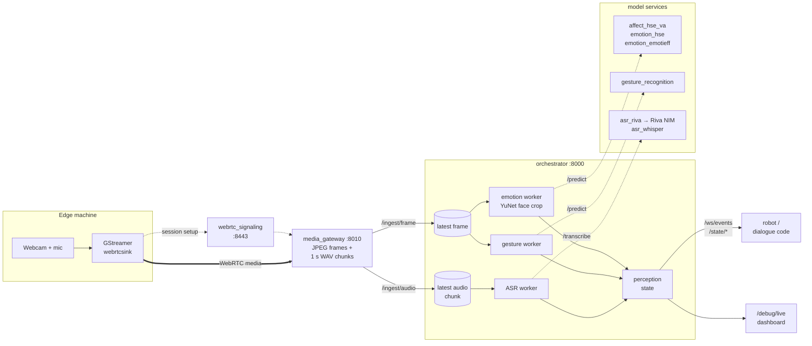

# HRI Perception Platform

Real-time multimodal perception for human-robot interaction. The platform takes a live camera and microphone stream over WebRTC and turns it into a single event stream your robot or dialogue code can subscribe to: **facial emotion, valence–arousal, head and hand gestures, and speech transcripts**.

Every model runs in its own container behind a shared contract, so you can swap backends by editing one line of YAML, with no restart and no code changes.

Developed at the In Real-Life Intelligent Robotics Lab (IRL2), Oakland University, for robot-mediated training studies. It is the perception layer behind the [BST Data Collection Platform](https://github.com/Intelligent-Robotics-Lab/bst-data-collection-platform).

<!-- TODO: add a screenshot or short GIF of the /debug/live dashboard here -->

## Highlights

- **One stream, many signals.** Emotion, gesture, and ASR results arrive as typed JSON events on a single WebSocket, plus REST endpoints for the latest state.
- **Hot-swappable models.** Each task has an `active_backend` in `perception_config.yaml`. The orchestrator re-reads the file when it changes, so switching from Whisper to Riva, or between emotion models, takes effect live.
- **Freshness over completeness.** Every stage keeps only the newest frame and audio chunk and drops stale data, so the robot reacts to what the person is doing now, not to a backlog.
- **Per-stage latency built in.** Each update carries queue delay, model inference time, and server pipeline time.
- **Transport-independent.** Workers and model services never see the transport. WebRTC is the live path, and a plain HTTP uploader is kept for debugging and fallback.

## Architecture



1. The edge machine captures webcam and microphone with GStreamer and publishes them over WebRTC.
2. `media_gateway` receives the session, decodes video to JPEG frames and audio to 16 kHz mono WAV chunks (1 s each), and posts them to the orchestrator.
3. The orchestrator keeps only the latest frame and audio chunk. Three workers poll them: the emotion worker detects the largest face with OpenCV YuNet and sends the crop to the active emotion backend; the gesture worker sends the full frame to the gesture service; the ASR worker sends each audio chunk to the active speech backend.
4. Results land in a shared perception state, which pushes an event to every WebSocket client and serves the latest values over REST.

## What it perceives

| Task | Service (port) | Model | Output |
|---|---|---|---|
| Facial emotion + valence–arousal **(default)** | `affect_hse_va` (8005) | HSEmotion `enet_b0_8_va_mtl`, ONNX, CPU | 7-class scores, dominant label, valence, arousal, quadrant |
| Facial emotion | `emotion_hse` (8001) | HSEmotion `enet_b0_8_best_afew`, ONNX, CPU | 7-class scores, dominant label |
| Facial emotion | `emotion_emotieff` (8002) | EmotiEffLib `enet_b0_8_best_vgaf`, ONNX, CPU | 7-class scores, dominant label |
| Head and hand gestures | `gesture_recognition` (8006) | MediaPipe Holistic + rule-based event detector | `nod`, `shake_head`, `one_hand_up` |
| Speech recognition **(default)** | `asr_riva` (8004) → `riva_runtime` (9000) | NVIDIA Riva ASR NIM, GPU | transcript |
| Speech recognition | `asr_whisper` (8003) | faster-whisper `tiny.en`, CPU, int8 | transcript |

All emotion backends map their outputs onto the same seven platform labels: `angry`, `disgust`, `fear`, `happy`, `sad`, `surprise`, `neutral` (contempt is merged into disgust). Downstream code doesn't change when you switch models.

Supporting services: `orchestrator` (8000), `media_gateway` (8010), and `webrtc_signaling` (8443, the GStreamer `gst-webrtc-signalling-server`).

## Quick start

### Prerequisites

- **Server:** Docker with Compose v2.
- **For Riva ASR (optional):** an NVIDIA GPU, the NVIDIA Container Toolkit, and an NGC API key. Without these, use Whisper on CPU (see step 3).
- **Edge machine:** either GStreamer with the Rust WebRTC plugin (`webrtcsink`, from gst-plugins-rs) for the live path, or Python 3 for the HTTP fallback client.
- Internet access on first start: the emotion services download their model weights when they launch.

### 1. Clone and add the face detector

```bash
git clone https://github.com/Intelligent-Robotics-Lab/hri_perception_platform.git
cd hri_perception_platform

mkdir -p data/models
curl -L -o data/models/face_detection_yunet_2023mar.onnx \
  https://github.com/opencv/opencv_zoo/raw/main/models/face_detection_yunet/face_detection_yunet_2023mar.onnx
```

The orchestrator loads this model at startup and won't start without it. `data/` is git-ignored; it also holds debug images and logs.

### 2. Create `.env`

```bash
# WebRTC signaling: the server address the edge machine can reach
HRI_SIGNALING_HOST=192.168.1.50
HRI_SIGNALING_PORT=8443
HRI_SIGNALING_USE_TLS=false

# NVIDIA Riva ASR NIM (only used if riva_runtime is started).
# Example values from NVIDIA's ASR NIM docs; use the model your lab deploys.
NGC_API_KEY=nvapi-...
CONTAINER_ID=parakeet-1-1b-ctc-en-us
NIM_TAGS_SELECTOR=name=parakeet-1-1b-ctc-en-us,mode=all
```

### 3. Start the stack

With a GPU (Riva ASR):

```bash
docker compose up --build
```

CPU only (Whisper ASR): set `speech_recognition.active_backend: asr_whisper` in `orchestrator/app/config/perception_config.yaml`, then start everything except the Riva runtime:

```bash
docker compose up --build orchestrator affect_hse_va gesture_recognition media_gateway webrtc_signaling
```

Check it's up:

```bash
curl http://localhost:8000/health
```

### 4. Stream from the edge machine

**Live path (WebRTC).** On a Windows edge machine, in PowerShell:

```powershell
gst-launch-1.0 webrtcsink name=wsink `
  signaller::uri="ws://<SERVER_IP>:8443" `
  congestion-control=disabled `
  enable-mitigation-modes=none `
  video-caps="video/x-h264" `
  mfvideosrc do-timestamp=true ! `
  video/x-raw,width=640,height=480,framerate=15/1 ! `
  queue max-size-buffers=4 leaky=downstream ! `
  videoconvert ! `
  x264enc tune=zerolatency speed-preset=veryfast bitrate=4000 key-int-max=30 bframes=0 ref=1 ! `
  h264parse config-interval=1 ! `
  queue max-size-buffers=4 leaky=downstream ! `
  wsink. `
  wasapisrc low-latency=true ! `
  queue max-size-buffers=8 leaky=downstream ! `
  audioconvert ! `
  audioresample ! `
  audio/x-raw,rate=48000,channels=1 ! `
  queue max-size-buffers=8 leaky=downstream ! `
  wsink.
```

On Linux, swap `mfvideosrc` and `wasapisrc` for `v4l2src` and `pulsesrc`.

**Fallback path (HTTP).** No GStreamer needed. This sends JPEG frames and WAV chunks straight to the orchestrator:

```bash
cd client
pip install -r requirements.txt
# replace YOUR_SERVER_IP in app/config/client_config.yaml
python -m app.main        # choose "video" or "audio"; run two terminals for both
```

### 5. Watch it work

Open **`http://<SERVER_IP>:8000/debug/live`**. The dashboard shows the latest input and annotated frames, the current emotion, gesture, and utterance, per-stage latency, and media gateway status.

## Using the output in your robot code

Subscribe to `ws://<SERVER_IP>:8000/ws/events`. Every result is pushed as JSON with an `event_type` of `emotion_update`, `gesture_update`, or `asr_update`.

```python
import asyncio
import json

import websockets  # pip install websockets


async def main():
    async with websockets.connect("ws://<SERVER_IP>:8000/ws/events") as ws:
        async for message in ws:
            event = json.loads(message)
            payload = event["payload"]

            if event["event_type"] == "emotion_update":
                pred = payload.get("prediction") or {}
                print("emotion:", pred.get("dominant_label"), pred.get("valence"), pred.get("arousal"))

            elif event["event_type"] == "gesture_update":
                pred = payload.get("prediction") or {}
                if pred.get("instant_gesture") not in (None, "none"):
                    print("gesture:", pred["instant_gesture"])

            elif event["event_type"] == "asr_update" and payload.get("transcript"):
                print("heard:", payload["transcript"])


asyncio.run(main())
```

An `emotion_update` with the default `affect_hse_va` backend looks like this (illustrative values, trimmed):

```json
{
  "event_type": "emotion_update",
  "timestamp_utc": "2026-06-11T15:04:05.123456+00:00",
  "source_id": "media_gateway_video",
  "payload": {
    "frame_id": 1842,
    "active_model": "affect_hse_va",
    "face_detected": true,
    "bbox_xyxy": [212, 98, 371, 290],
    "prediction": {
      "dominant_label": "happy",
      "confidence": 0.81,
      "scores": {"angry": 0.02, "disgust": 0.01, "fear": 0.01, "happy": 0.81, "sad": 0.03, "surprise": 0.04, "neutral": 0.08},
      "valence": 0.54,
      "arousal": 0.21,
      "quadrant": "pleasant-active",
      "latency_ms": 17.6
    },
    "metrics": {
      "worker_queue_delay_ms": 3.1,
      "backend_inference_latency_ms": 17.6,
      "server_pipeline_latency_ms": 41.2
    }
  }
}
```

For gestures, `instant_gesture` fires once per detected event, and `detected_gesture` holds the last event for about 1.25 s, which is handy for display.

[`sample_team_integration/`](sample_team_integration/) has a reusable `PerceptionClient` and a small rule-based agent that reacts to transcripts and emotion together. Run it with `pip install websockets && python interaction_demo.py`; it connects to `localhost`, so change `server_host` if the server is remote.

## Orchestrator API

| Method | Path | Purpose |
|---|---|---|
| `GET` | `/health` | Liveness check |
| `WS` | `/ws/events` | Push stream of `emotion_update`, `gesture_update`, `asr_update` events |
| `GET` | `/state/emotion` · `/state/gesture` · `/state/asr` | Latest result per task |
| `GET` | `/metrics/live/emotion` · `/metrics/live/gesture` · `/metrics/live/asr` | Latest per-stage latency per task |
| `POST` | `/ingest/frame` | Multipart image upload (`file`, optional `client_capture_timestamp`) |
| `POST` | `/ingest/audio` | Multipart audio upload (`file`, optional `client_capture_timestamp`, `source_id`, `sample_rate_hz`, `channels`, `encoding`) |
| `GET` | `/debug/live` | Live debug dashboard |
| `GET` | `/debug/image/input` · `/annotated` · `/face` · `/gesture` | Latest debug images |
| `GET` | `/debug/gateway-status` | WebRTC session, video, and audio status from `media_gateway` |
| `GET` | `/test-emotion` | Smoke test on `data/test_inputs/face.jpg` |

FastAPI's interactive docs are at `http://<SERVER_IP>:8000/docs`.

## Configuration

### Choosing models

`orchestrator/app/config/perception_config.yaml` decides which backend serves each task:

```yaml
tasks:
  emotion_recognition:
    active_backend: affect_hse_va     # or emotion_hse, emotion_emotieff
    backends:
      emotion_hse:      { url: http://emotion_hse:8001 }
      emotion_emotieff: { url: http://emotion_emotieff:8002 }
      affect_hse_va:    { url: http://affect_hse_va:8005 }

  speech_recognition:
    active_backend: asr_riva          # or asr_whisper
    backends:
      asr_whisper: { url: http://asr_whisper:8003 }
      asr_riva:    { url: http://asr_riva:8004 }

  gesture_recognition:
    active_backend: gesture_head_motion
    backends:
      gesture_head_motion: { url: http://gesture_recognition:8006 }
```

The config folder is mounted into the orchestrator, and the orchestrator re-reads the file whenever it changes. Edit `active_backend` and the next frame or audio chunk goes to the new model. An `object_detection` task slot is defined but has no backend yet.

### Adding a backend

Every model service implements the same small contract:

- `GET /health` and `GET /metadata`
- Vision: `POST /predict` taking an `EmotionPredictRequest` (base64 JPEG plus frame metadata; see [`shared/contracts/schemas.py`](shared/contracts/schemas.py))
- Audio: `POST /transcribe` taking a multipart WAV chunk

To add one, build a container that implements the contract, add it to `docker-compose.yml`, register its URL under the task in `perception_config.yaml`, and set it as `active_backend`.

### Other settings

| Where | Setting | Default |
|---|---|---|
| `media_gateway` env | `MEDIA_GATEWAY_AUDIO_CHUNK_MS` | `1000` |
| | `MEDIA_GATEWAY_AUDIO_SAMPLE_RATE_HZ` / `_CHANNELS` | `16000` / `1` |
| | `MEDIA_GATEWAY_VIDEO_STALL_TIMEOUT_SEC` | `20.0` |
| | `MEDIA_GATEWAY_RECONNECT_BACKOFF_SEC` | `1.0` |
| | `MEDIA_GATEWAY_ENABLE_VIDEO_FORWARDING` / `_AUDIO_FORWARDING` | `true` / `true` |
| `asr_whisper` env | `ASR_MODEL_SIZE`, `ASR_DEVICE`, `ASR_COMPUTE_TYPE`, `ASR_LANGUAGE` | `tiny.en`, `cpu`, `int8`, `en` |
| `asr_riva` env | `ASR_LANGUAGE` | `en-US` |

## Latency

Design choices that keep the loop fast:

- **Latest-only stores.** The orchestrator holds one frame and one audio chunk. Workers skip anything they've already processed, so a slow model never builds a queue.
- **Shallow, leaky buffers end to end.** Edge queues drop downstream, and the gateway's video sink keeps a single buffer and drops the rest.
- **Measured by stage.** Every event's `metrics` reports `worker_queue_delay_ms`, `backend_inference_latency_ms`, and `server_pipeline_latency_ms`. End-to-end latency isn't computed on the server, because edge and server clocks aren't guaranteed to be in sync.

Targets from [`docs/latency_budget.md`](docs/latency_budget.md):

| Stage | Target | Measured so far |
|---|---|---|
| Emotion model inference | < 30 ms steady state | ~18 ms |
| Server overhead beyond model time | < 20 ms | tens of ms |
| Visual perception cadence | ≥ 15 FPS (20–30 preferred) | edge sends 15 FPS |
| Turn end → robot speech onset (system level) | < 700 ms | not owned by this repo |
| Interruption reaction (system level) | < 250 ms | not owned by this repo |

## Offline evaluation

Replay a recorded video through the active emotion backend and summarize the results:

```bash
# place a video at data/test_inputs/sample.mp4
docker compose exec orchestrator python3 -m app.ingest.replay_emotion
docker compose exec orchestrator python3 -m app.evaluation.summarize_replay
```

The replay processes every 10th frame and writes per-frame results to `data/logs/replay_emotion.jsonl`. The summary reports face-detection rate, inference success, latency, and label counts.

## Repository layout

```text
orchestrator/              FastAPI hub: ingest, workers, state, WebSocket, debug dashboard
  app/config/              perception_config.yaml (active backend per task)
  app/workers/             emotion, gesture, and ASR workers
  app/ingest/              latest-frame / latest-audio stores, replay tool
services/
  affect_hse_va/           emotion + valence–arousal (HSEmotion multitask)
  emotion_hse/             emotion (HSEmotion)
  emotion_emotieff/        emotion (EmotiEffLib)
  gesture_recognition/     nod / head shake / raised hand (MediaPipe)
  asr_riva/                passthrough to the NVIDIA Riva ASR NIM
  asr_whisper/             faster-whisper ASR
  media_gateway/           WebRTC receiver → frames and audio chunks
  webrtc_signaling/        GStreamer WebRTC signalling server
shared/contracts/          request/response schemas shared by services
edge_client/               GStreamer sender scripts and pipeline notes
client/                    HTTP fallback sender (webcam / microphone)
sample_team_integration/   WebSocket client and example interaction agent
docs/                      latency budget and transport design notes
```

## Status

This is a research platform in active use. Known limits:

- ASR transcribes 1 s chunks. Streaming partial transcripts, targeted in the latency budget, aren't implemented yet.
- The vision backends run on CPU.
- The tested edge sender is Windows (`mfvideosrc` / `wasapisrc`).
- The `object_detection` task slot has no backend yet.

## Acknowledgments

Built on [HSEmotion](https://github.com/av-savchenko/hsemotion-onnx), [EmotiEffLib](https://github.com/sb-ai-lab/EmotiEffLib), [MediaPipe](https://github.com/google-ai-edge/mediapipe), [faster-whisper](https://github.com/SYSTRAN/faster-whisper), [NVIDIA Riva ASR NIM](https://docs.nvidia.com/nim/speech/latest/), [OpenCV YuNet](https://github.com/opencv/opencv_zoo/tree/main/models/face_detection_yunet), and the GStreamer [WebRTC plugins](https://gitlab.freedesktop.org/gstreamer/gst-plugins-rs).

Author: [Pourya Shahverdi](https://github.com/pourya-shahverdi), In Real-Life Intelligent Robotics Lab (IRL2), Oakland University.
