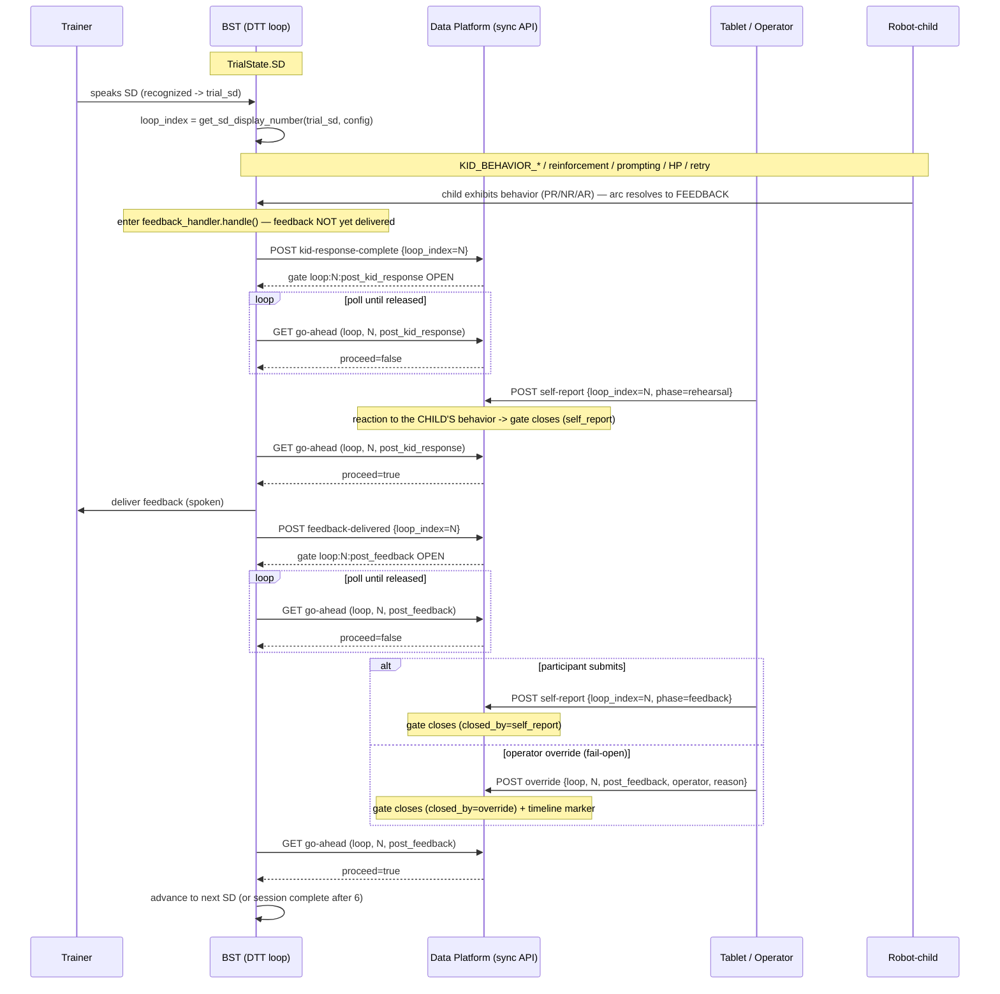

# BST ↔ Data Platform Sync Integration — change spec for the BST owners

Status: SPEC ONLY. Nothing in the BST repo has been or should be edited by the
data-platform side. This document tells the BST owners exactly what to add on
their side to talk to the already-built data-platform sync gate API.

The **data-platform side is implemented** (endpoints, gate state machine, schema,
exports, tests). This spec is the matching BST-side work: one new module, three
one-line-ish hooks in the DTT path, one end-of-stage hook in `BaseInteraction`,
and `session_id` threading.

---

## 0. What a "gate" is and the two policies it encodes

A **gate** is a barrier the BST run waits on so a self-report can be collected
before BST advances. **15 gates per fully gated session:**

- **3 instructional baseline gates** — end of `tutorial`, `instruction`,
  `modeling` (scope `stage`, checkpoint `baseline`).
- **12 loop gates** — each of the 6 DTT loops has **two**: `post_kid_response`
  (after the child-behavior arc completes, before feedback) and `post_feedback`
  (after feedback). The `post_kid_response` report measures the participant's
  emotional reaction to the **child's behavior** — the PR/NR/AR manipulation —
  NOT to the SD instruction, so its gate opens only once the kid has exhibited
  its behavior/problem behavior and any prompting/HP/retry has resolved.

Settled policies baked into the platform side:

- **Gate opens** on `stage_complete` / `kid_response_complete` / `feedback_delivered`;
  **closes** on EITHER the matching self-report being submitted OR an operator
  **override**. `go_ahead` returns `proceed=false` only while an open gate is
  unsatisfied.
- **Fail-open is via operator override**, not a BST-side timeout. When the
  operator overrides, the platform writes a `self_report_gate_overridden` marker
  (timeline + `sync_gates.closed_by='override'`, distinguishable in exports) and
  `go_ahead` flips to `proceed=true`. **BST therefore just polls until
  `proceed=true`; it never needs to decide to skip.** (An optional long BST-side
  safety log is fine, but the release decision is the operator's.)

Gate identity key (every call): `(session_id, stage-or-loop_index, checkpoint)`.

---

## 1. Map BST concepts → platform fields

| BST | Platform | Where in BST |
| --- | --- | --- |
| `study_config["configuration"]` (1/2/3) | `pb_order_group` | `BST()` startup prompt |
| `study_config["trainer_feedback_style"]` (supportive/neutral) | `support_condition` (1/0) | `BST()` startup prompt |
| `ctx.trial_sd` (trial-name) + configuration → `get_sd_display_number(...)` | `loop_index` (1..6) | `logic/latin_square.py` |
| stage = `self.get_module_name()` (tutorial/instruction/modeling) | gate `stage` | `BaseInteraction` |

`get_sd_display_number(ctx.trial_sd, ctx.latin_square_configuration)` already
returns the 1..6 display cell — that **is** the platform `loop_index`. Send the
display cell, never the trial-name, as `loop_index`; the platform resolves
`function_class` itself.

The self-reports that satisfy each gate are submitted on the **platform side**
(tablet/operator), not by BST. BST only opens gates and waits. The platform's
close-by-self-report rule (for reference) is:

| checkpoint | satisfied by a self-report with |
| --- | --- |
| stage `baseline` | `phase == <stage>` (loop_index NULL) |
| loop `post_kid_response` | `loop_index == N` and `phase == 'rehearsal'` |
| loop `post_feedback` | `loop_index == N` and `phase == 'feedback'` |

---

## 2. The integration contract (endpoints, already live on the platform)

Base: `POST/GET {PLATFORM_BASE}/sessions/{session_id}/sync/...`. Transport HTTP
(matches BST's existing HTTP use). BST → platform for progress; BST **polls** for
the go-signal (no inbound server needed in BST).

| Call | Method / path | Body / query | Returns |
| --- | --- | --- | --- |
| register | `POST …/sync/register` | – | `{pb_order_group, support_condition, support_label, …}` — confirm alignment |
| stage_complete | `POST …/sync/stage-complete` | `{stage}` | gate (opened) |
| kid_response_complete | `POST …/sync/kid-response-complete` | `{loop_index, trial_name?}` | gate (opened) |
| feedback_delivered | `POST …/sync/feedback-delivered` | `{loop_index, trial_name?, evaluation_summary?}` | gate (opened) |
| go_ahead (poll) | `GET …/sync/go-ahead` | `?scope=stage|loop&checkpoint=baseline|post_kid_response|post_feedback&stage=…&loop_index=…` | `{proceed: bool, gate_found: bool, gate}` |
| override (operator) | `POST …/sync/override` | `{scope, checkpoint, stage?, loop_index?, operator?, reason?}` | gate (closed) |
| session_complete | `POST …/sync/complete` | – | `{total_gates, open_gates, closed_gates, overridden_gates}` |

All opener calls are **idempotent**: re-sending after a gate has closed does NOT
reopen it (safe under BST retries). `override` is operator-only — BST never calls
it.

---

## 3. BST-side changes (proposed; not applied)

### 3.1 New module `logic/sync_client.py`

A thin async HTTP client. Reads `PLATFORM_BASE` and `session_id` from
`study_config`. All calls swallow/log network errors except `wait_for_go_ahead`,
which must keep polling.

```python
# logic/sync_client.py  (PROPOSED - new file)
import asyncio, aiohttp   # or httpx; BST already does async HTTP for perception

class SyncClient:
    def __init__(self, base_url, session_id, poll_interval=0.5):
        self.base = base_url.rstrip("/")
        self.sid = session_id
        self.poll = poll_interval

    def _url(self, path): return f"{self.base}/sessions/{self.sid}/sync/{path}"

    async def register(self): ...                      # POST register
    async def stage_complete(self, stage): ...         # POST stage-complete {stage}
    async def kid_response_complete(self, loop_index, trial_name=None): ...
    async def feedback_delivered(self, loop_index, trial_name=None, evaluation_summary=None): ...
    async def complete(self): ...                      # POST complete

    async def go_ahead(self, *, scope, checkpoint, stage=None, loop_index=None):
        # GET go-ahead with the gate identity; returns the parsed JSON
        ...

    async def wait_for_go_ahead(self, *, scope, checkpoint, stage=None, loop_index=None):
        """Poll until proceed=True. The operator override is the release valve;
        BST does not self-skip. Optional: log a warning past N seconds."""
        while True:
            res = await self.go_ahead(scope=scope, checkpoint=checkpoint,
                                      stage=stage, loop_index=loop_index)
            if res.get("proceed"):
                return res
            await asyncio.sleep(self.poll)
```

### 3.2 `session_id` threading + register/complete in `logic/bst.py`

`BST()` already collects `study_config`. Add a `session_id` (prompt, or fetch the
active session from the platform), then register once:

```python
# logic/bst.py  BST()  (PROPOSED edits)
study_config = {
    "participant_name": input("Participant name: "),
    "configuration": input("Configuration (1, 2, or 3): "),
    "trainer_feedback_style": input("Feedback style (supportive or neutral): "),
    "session_id": input("Data-platform session_id: "),        # NEW
    "platform_base": PLATFORM_BASE,                            # NEW (from config/env)
}
sync = SyncClient(study_config["platform_base"], study_config["session_id"])
await sync.register()   # confirm pb_order_group / support_condition alignment
try:
    await Tutorial(...).execute();    ...
    await DTT(...).execute()
finally:
    await sync.complete()
    ...
```

`study_config` is already passed into every stage, so each stage/handler can
build its own `SyncClient` from it (or stash one on `self`).

### 3.3 Instructional end-of-stage gate — `logic/base_interaction.py`

`Tutorial`, `Instruction`, `Modeling` all subclass `BaseInteraction` and share
`execute()`; `get_module_name()` returns the stage name. One hook covers all
three (DTT does NOT subclass `BaseInteraction`, so it is unaffected):

```python
# logic/base_interaction.py  BaseInteraction.execute()  (PROPOSED, after run_main_loop)
try:
    await self.run_main_loop(agent)
finally:
    task.cancel()

stage = self.get_module_name()                      # tutorial | instruction | modeling
if stage in ("tutorial", "instruction", "modeling"):
    sync = SyncClient(self.study_config["platform_base"], self.study_config["session_id"])
    await sync.stage_complete(stage)                                  # opens baseline gate
    await sync.wait_for_go_ahead(scope="stage", stage=stage, checkpoint="baseline")
```

### 3.4 DTT loop gates — exact hooks

**The seam (re-traced).** A trial flows: `SD` → `KID_BEHAVIOR_1` →
`REINFORCEMENT` → (on a wrong response, `PROMPTING` → `HP_SD` → `RETRY_SD`, each
re-entering `KID_BEHAVIOR_*` then `REINFORCEMENT`). The **only** transition into
`FEEDBACK` is `reinforcement_handler.py:81-82` (when `reinforcement_source` is
`correct` or `retry`); every resolution path funnels through it. Therefore
`feedback_handler.handle()` runs **only once the entire child-behavior arc —
including any prompting/HP/retry and the reinforcement reaction — is complete,
and before any feedback is spoken.** That is the correct seam for the first
report: it measures the participant's reaction to the **child's behavior**
(PR/NR/AR), not to the SD instruction.

> The earlier draft put this hook in `sd_processing_handler` at the entry to the
> KID state — that fires before the child has behaved and is wrong. It is removed;
> `sd_processing_handler` is no longer a hook.

Both per-loop gates live in **`logic/dtt_module/handlers/feedback_handler.py`,
`handle()`** — gate 1 at the very top (before feedback is delivered), gate 2
after feedback is spoken.

**Hook A — `post_kid_response`: top of `feedback_handler.handle()`, before the
feedback LEDs/speak (before ~line 36-86).**

```python
# child-behavior arc is complete (we are in FEEDBACK); feedback NOT yet delivered:
loop_index = get_sd_display_number(ctx.trial_sd, ctx.latin_square_configuration)
await sync.kid_response_complete(loop_index, trial_name=ctx.trial_sd)   # opens post_kid_response
await sync.wait_for_go_ahead(scope="loop", loop_index=loop_index, checkpoint="post_kid_response")
# ... existing feedback delivery (LEDs, build evaluation, expr.execute at ~line 86) ...
```

**Hook B — `post_feedback`: same `handle()`, after the feedback is spoken (~line
86) and after `completed_sds.add(...)` (~line 121), before it resets to `USER/SD`
(~line 147).**

```python
# after completed_sds.add(ctx.trial_sd):
await sync.feedback_delivered(loop_index, trial_name=ctx.trial_sd)      # opens post_feedback
if len(ctx.completed_sds) >= 6:
    ...  # existing session-complete behavior unchanged
    return
await sync.wait_for_go_ahead(scope="loop", loop_index=loop_index, checkpoint="post_feedback")
# existing reset to USER/SD
```

**Hook C — `main_dtt_loop()` poll (`logic/dtt.py`, the `while DTT_IN_PROGRESS:`
loop ~line 350).** With the inline `wait_for_go_ahead` calls above, the main loop
needs no change. **Responsive alternative** (keeps freeze / system-command
detection live during the wait, since an inline `await` inside `feedback_handler`
pauses the main loop): don't block in the handler — defer the transitions and let
the main loop poll. Open gate 1 at the sole FEEDBACK transition
(`reinforcement_handler.py:81-82`) instead of setting `FEEDBACK` directly:

```python
# reinforcement_handler.py, the reinforcement_source in ("correct","retry") branch:
loop_index = get_sd_display_number(ctx.trial_sd, ctx.latin_square_configuration)
await sync.kid_response_complete(loop_index, trial_name=ctx.trial_sd)
ctx.pending_go = {"scope": "loop", "loop_index": loop_index, "checkpoint": "post_kid_response"}
ctx.pending_go_target = (CurrentState.TRAINER, TrialState.FEEDBACK)     # deferred; do not set here
```

open gate 2 at the end of `feedback_handler.handle()` the same way
(`pending_go_target = (CurrentState.USER, TrialState.SD)`), and add the poll to
`main_dtt_loop` before `state_machine.process(...)` (~line 454):

```python
if getattr(ctx, "pending_go", None) is not None:
    res = await sync.go_ahead(**ctx.pending_go)
    if res["proceed"]:
        ctx.state, ctx.trial_state = ctx.pending_go_target             # apply deferred transition
        ctx.pending_go = None
        ctx.pending_go_target = None
    await asyncio.sleep(0.1)
    continue                                                           # stay gated; skip the rest
```

with `pending_go: dict | None = None` and `pending_go_target: tuple | None = None`
added to `TrialContext`. Tradeoff: more moving parts. Recommended default is the
inline approach (simpler; the waits are deliberate self-report pauses). Either
way gate 1 opens only after the kid-behavior arc completes and before feedback.

### 3.5 Net BST change
- New `logic/sync_client.py`.
- `BST()`: add `session_id`/`platform_base`, `register()`, `complete()`.
- `BaseInteraction.execute()`: ~3 lines (covers all 3 instructional stages).
- `feedback_handler.handle()`: ~4 lines — both per-loop gates live here (gate 1
  before the feedback speak, gate 2 after).
- `sd_processing_handler` is **not** touched (the first report fires after the
  child behaves, not at SD delivery).
- Responsive alternative only: ~3 lines at `reinforcement_handler.py:81-82`, a
  ~6-line poll block in `main_dtt_loop`, and 2 new `TrialContext` fields.
- Zero changes to the state machine logic, the recognizer, or robot/perception
  behavior.

---

## 4. Sequence diagrams

### 4.1 One DTT loop (two barriers)



### 4.2 One instructional stage (baseline barrier)

```mermaid
sequenceDiagram
    participant BST as BST (BaseInteraction.execute)
    participant API as Data Platform (sync API)
    participant TAB as Tablet / Operator

    Note over BST: run_main_loop() walks the stage content to the end
    BST->>API: POST stage-complete {stage=tutorial}
    API-->>BST: gate stage:tutorial:baseline OPEN
    BST->>BST: await wait_for_go_ahead(stage, tutorial, baseline)

    loop poll until released
        BST->>API: GET go-ahead (stage, tutorial, baseline)
        API-->>BST: proceed=false
    end

    alt baseline self-report
        TAB->>API: POST self-report {phase=tutorial, loop_index=null}
        Note over API: gate closes (closed_by=self_report)
    else operator override
        TAB->>API: POST override {stage, tutorial, baseline}
        Note over API: gate closes (closed_by=override) + marker
    end
    BST->>API: GET go-ahead (stage, tutorial, baseline)
    API-->>BST: proceed=true
    BST->>BST: return; BST() proceeds to the next stage
```

(`instruction` and `modeling` are identical with their own stage name.)

---

## 5. Notes for the BST owners
- `PLATFORM_BASE` should come from BST config/env (host\:port of the FastAPI
  app), mirroring how the perception client host is configured.
- The platform owns `session_id`, `dtt_loops`, `function_class`, and the
  self-reports; BST sends only the positional `loop_index`. Neither system writes
  the other's tables.
- All `go-ahead` polling is cheap and idempotent; a 0.5 s interval is fine.
- Override is the single fail-open path; it is operator-driven on the platform
  and always leaves an exported marker, so a skipped measurement is never
  confused with a missing one.
```
